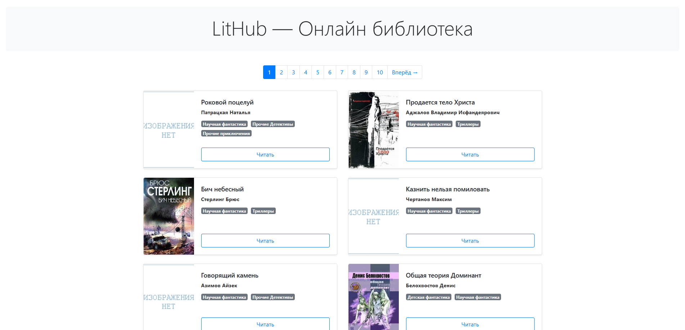

# LitHub — Онлайн библиотека
  
LitHub — это простой статический сайт для чтения книг офлайн и онлайн.

---

## Ссылки

- Репозиторий проекта: https://github.com/Tikhovskoy/LitHub  
- Опубликованная версия (GitHub Pages):  
  https://tikhovskoy.github.io/LitHub/  

---

## Способ установки

1. Склонировать репозиторий:
   ```bash
   git clone https://github.com/Tikhovskoy/LitHub.git
   cd LitHub
   ```
2. Установить зависимости:
   ```bash
   python3 -m venv venv
   source venv/bin/activate
   pip install -r requirements.txt
   ```
3. Сгенерировать сайт:
   ```bash
   python render_website.py
   ```
4. Открыть локально:
   ```bash
   open docs/index.html
   ```
5. Шаблоны лежат в папке `templates/`, данные о книгах — в `meta_data.json`.  
   Можно править шаблоны, добавлять книги и опять запускать скрипт.

---

## Пример



---

## Структура проекта

```
LitHub/
├── docs/               # Сгенерированный статический сайт
│   ├── index.html      # Главная страница
│   ├── index2.html     # Вторая страница каталога
│   ├── books_html/     # HTML‑версии отдельных книг
│   ├── static/         # CSS, JS, favicon
│   └── img/            # Обложки книг
├── templates/          # Jinja2‑шаблоны
├── img/                # Оригинальные обложки (для генерации)
├── static/             # Оригинальные стили и скрипты
├── meta_data.json      # Описание книг: пути, автор, жанры
├── render_website.py   # Скрипт генерации сайта
├── requirements.txt    # Python‑зависимости
└── README.md           # Этот файл
```

---

## Как внести изменения самостоятельно

1. Добавить новую книгу:
   - Поместить текст в папку, указанную в `meta_data.json`
   - Добавить запись в `meta_data.json` с полями:
     ```json
     {
       "title": "Название книги",
       "author": "Автор",
       "genres": "Жанр1, Жанр2",
       "book_path": "path/to/your.txt",
       "img_src": "img/cover.jpg"
     }
     ```
2. Запустить генерацию:
   ```bash
   python render_website.py
   ```
3. Закинуть обновлённую `docs/` на GitHub Pages или открыть локально.
